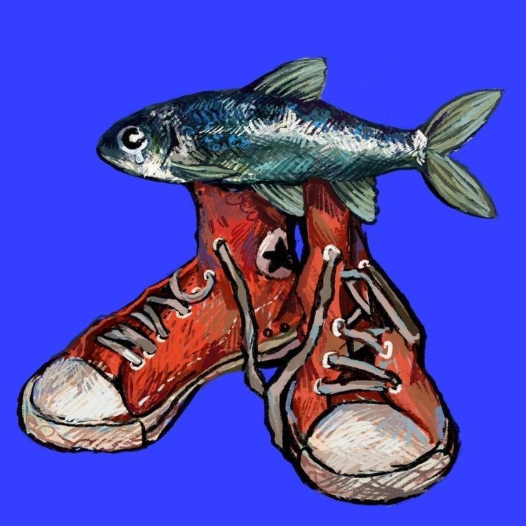
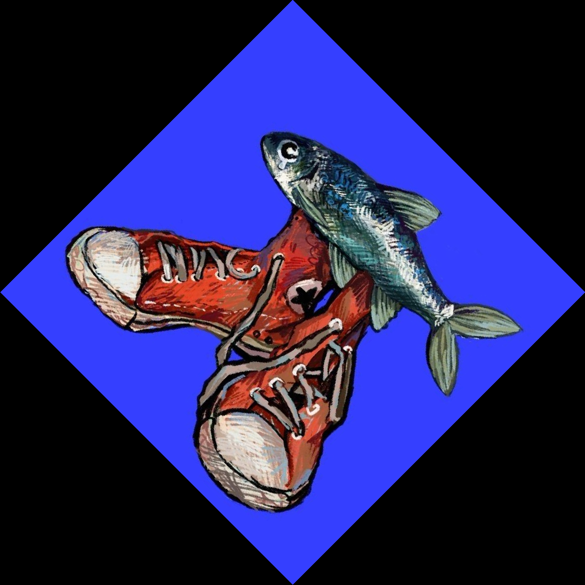
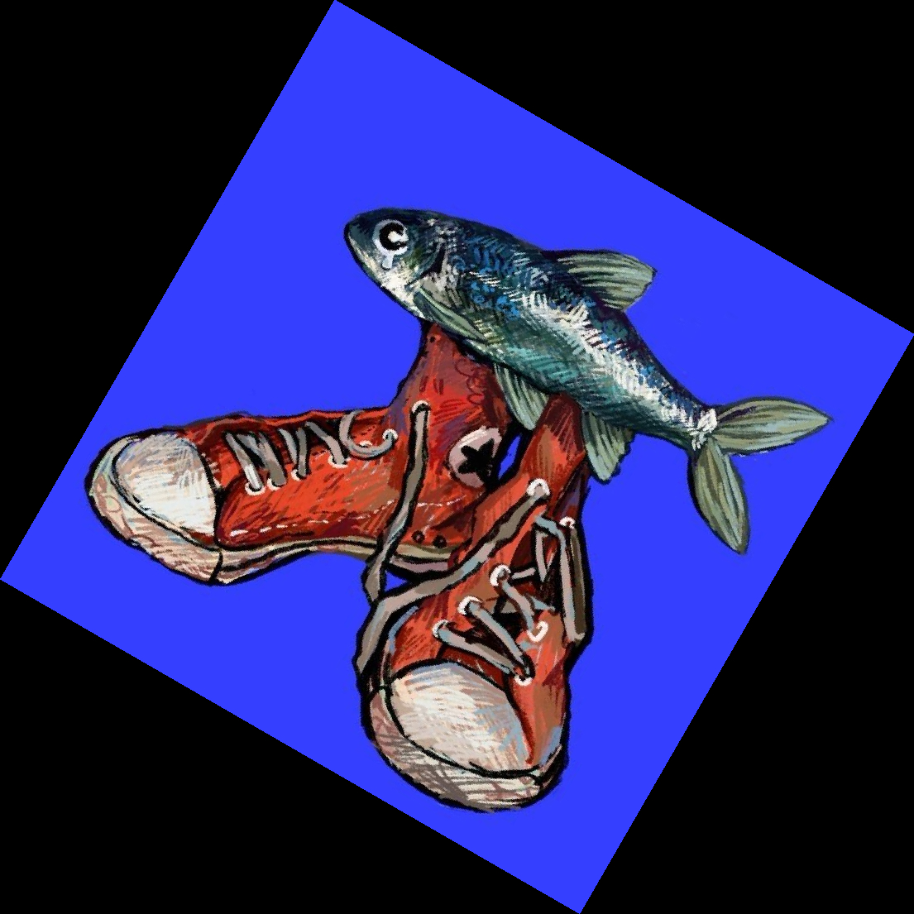
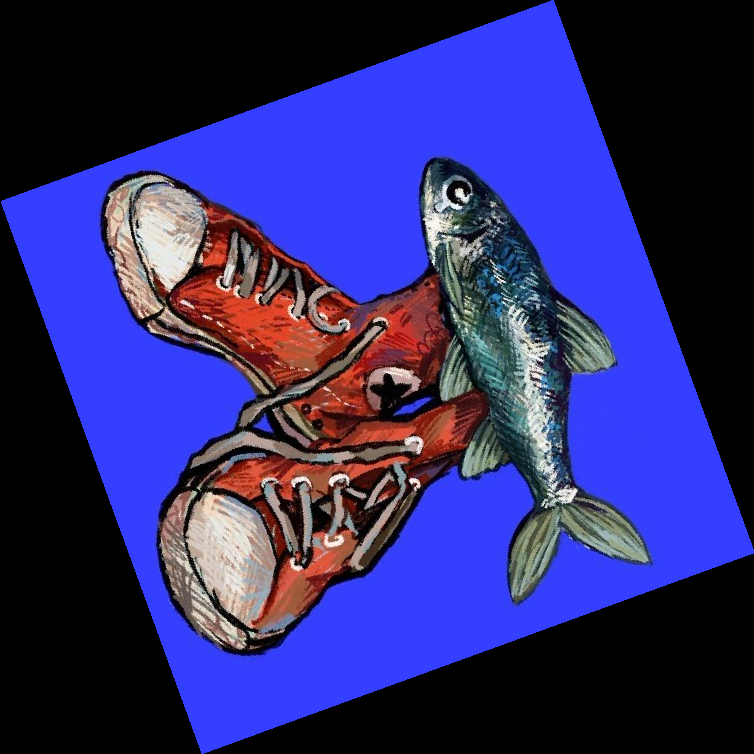
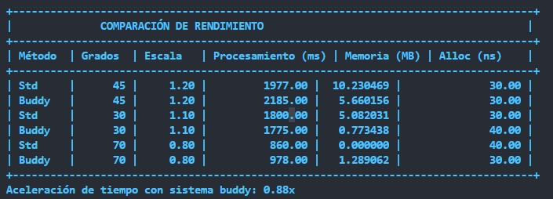

# Image Rotation and Scaling

This project provides functionality for rotating and scaling images using C++ with efficient memory management and performance tracking.

This specific version implements a paralelism approach using `OpenMP` library to transform any given input images, making it faster.

## Features
- **Image Rotation**: Rotate images by a specified angle.
- **Image Scaling**: Scale images by a given factor using bilinear interpolation.
- **Memory Usage Tracking**: Monitor memory usage during transformations.
- **Buddy System Support**: Optional memory allocation using the buddy system.
- **Paralelism approach**: Uses paralelism in bottlenecks features such as the transformation of the image.

## Requirements
- CMake 3.10 or higher
- A C++ compiler supporting C++14
- Eigen3 library
- OpenMP library

## Build Instructions
1. Clone the repository:
    ```bash
    git clone <repository-url>
    cd image_rotation_scaling
    ```

2. Create a build directory and navigate to it:
    ```bash
    mkdir build
    cd build
    ```

3. Run CMake to configure the project:
    ```bash
    cmake ..
    ```

4. Build the project:
    ```bash
    make
    ```

## Usage
After building the project, you can run the executable with the following command:
```bash
./ImageRotationScaling -entrada <inputPath> -salida <outputPath> -angulo <angle> -escalar <scaleFactor> <buddySystem> -divisiones <numDivisions>

./ImageRotationScaling -entrada ./imgs/fish.jpg -salida ./output/concurrence.jpg -angulo 45 -escalar 1.2 -divisiones 3 -fopenmp
```

### Parameters
- `<inputPath>`: Path to the input image file.
- `<outputPath>`: Path to save the transformed image.
- `<angle>`: Rotation angle in degrees.
- `<scaleFactor>`: Scaling factor (e.g., 1.5 for 150% scaling).
- `<buddySystem>`: `-buddy` to enable buddy system memory allocation, `0` to disable.
- `<numDivisions>`: Specifies the number of cuadrants that your image is going to be divided in and processed later on.

### Example
```bash
./ImageRotationScaling -entrada input.jpg -salida output.jpg -angulo 45 -escalar 1.2 -buddy -divisiones 2

./ImageRotationScaling -entrada ../test/fish.jpg -salida ../output/output.jpg -angulo 45 -escalar 1.2 -buddy -divisiones 4
```
This rotates `input.jpg` by 45 degrees, scales it by 1.2x, and uses the buddy system for memory allocation and divides into 4 cuadrants.

After running that command you are gonna get several outputs at `./output`, incluiding the plain transformation and outputs corresponding to benchmarks result if you opted for this option aswell.

1. **Input**

 

2. **Output**

 

3. **Benchmarks**

Benchmark testing for a:
- 45 degrees rotation and 1.2 scaling
- 30 degrees and 1.1 scaling
- 70 degress and 0.8 scaling.

 
 
 

4. **Perfomance table**

 

## License
This project is licensed under the terms specified in the `LICENSE` file.


## Acknowledgments
- Uses the [stb_image](https://github.com/nothings/stb) library for image loading.
- Built with the Eigen3 library for matrix operations. 